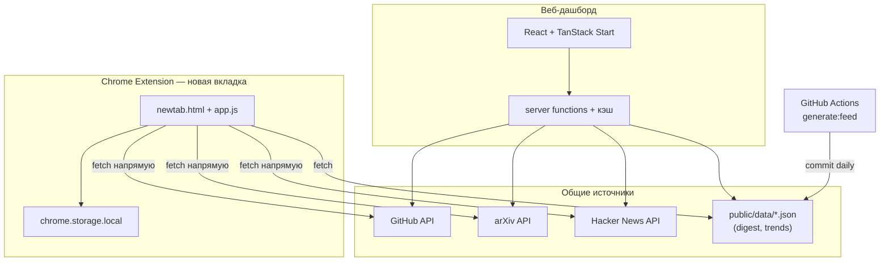

# Tech Evolution Radar (TechRadar)

Дашборд для отслеживания технологических сигналов: как «шум» превращается в тренды. Приложение агрегирует данные из открытых источников, классифицирует их по категориям и стадиям зрелости, выявляет аномалии и показывает эволюционные цепочки технологий.

Доступны публичный веб-дашборд (без входа и серверного хранилища) и расширение для Chrome, которое заменяет страницу новой вкладки.

## Возможности

- **Tech Radar** — интерактивная scatter-карта сигналов по категориям и стадиям зрелости
- **Tech Feed** — лента событий с фильтрацией по источникам, категориям и языку
- **AI Insight** — автоматическая сводка по текущим данным, трендам и аномалиям
- **Evolution Chains** — цепочки развития технологий от research до mass-market
- **Anomaly Detection** — выявление необычных всплесков активности
- **Daily Digest** — ежедневный AI-дайджест блогов (Anthropic, OpenAI, DeepMind и др.)
- **Мультиязычность** — интерфейс и контент на английском и русском
- **Chrome Extension** — та же аналитика на странице новой вкладки

## Стек

| Слой | Технологии |
|------|------------|
| Frontend | React 19, TanStack Router, TanStack Query, Tailwind CSS 4, shadcn/ui, Recharts, Motion |
| Backend | TanStack Start (SSR), server functions |
| Runtime | Bun, Vite |
| AI | Anthropic API (генерация дайджеста в CI) |
| Тесты | Vitest, Testing Library |

## Быстрый старт

### Требования

- [Bun](https://bun.sh/) (рекомендуется) или Node.js 22+

### Установка

```bash
bun install
bun run dev
```

Файл `.env` **не обязателен** — дашборд работает без секретов, данные берутся из публичных API.

Опционально (аналитика):

```bash
cp .env.example .env
# задайте VITE_INSTRUMENTATION_SCRIPT_SRC, если нужен скрипт метрик
```

### Разработка

```bash
bun run dev
```

Приложение будет доступно на [http://localhost:3000](http://localhost:3000).

### Production

```bash
bun run build
bun run start
```

Предпросмотр production-сборки без отдельного сервера:

```bash
bun run serve
```

## Переменные окружения

### Что нужно для запуска

| Сценарий | Нужны ли секреты? |
|----------|-------------------|
| `bun run dev` — локальная разработка | **Нет** |
| `bun run build` + `bun run start` — production | **Нет** |
| Chrome Extension | **Нет** (данные из публичных API и GitHub raw) |
| `bun run generate:feed` — локальная генерация дайджеста | **Да** — `ANTHROPIC_API_KEY` |
| CI (`generate-feed` workflow) | **Да** — secret `ANTHROPIC_API_KEY` в GitHub |

Приложение **не использует** внешнюю БД, Appwrite или другие платформы с API-ключами. Кэш live-данных — in-memory на сервере.

### Опционально (`.env`)

Скопируйте `.env.example` → `.env` только если нужны дополнительные настройки:

| Переменная | Обязательна | Описание |
|------------|-------------|----------|
| `VITE_INSTRUMENTATION_SCRIPT_SRC` | Нет | URL скрипта аналитики/инструментации в `<head>` |

### Генерация дайджеста

| Переменная | Обязательна | Где |
|------------|-------------|-----|
| `ANTHROPIC_API_KEY` | Да, только для `generate:feed` | Локально в `.env` или GitHub Actions secret |

```bash
# Локальный прогон пайплайна (не нужен для dev-сервера)
ANTHROPIC_API_KEY=sk-ant-... bun run generate:feed
```

> **Важно:** `ANTHROPIC_API_KEY` не должен попадать в репозиторий, клиентский код, `public/data/*.json` или расширение Chrome. Скрипт `check:secrets` проверяет артефакты перед коммитом в CI.

### Production-сервер (`server.ts`)

Все переменные ниже опциональны — есть разумные значения по умолчанию:

| Переменная | По умолчанию | Описание |
|------------|--------------|----------|
| `PORT` | `3000` | Порт HTTP-сервера |
| `ASSET_PRELOAD_MAX_SIZE` | `5242880` (5 MB) | Макс. размер файла для preload в память |
| `ASSET_PRELOAD_INCLUDE_PATTERNS` | все файлы | Glob-паттерны для preload |
| `ASSET_PRELOAD_EXCLUDE_PATTERNS` | — | Исключения из preload |
| `ASSET_PRELOAD_VERBOSE_LOGGING` | `false` | Подробные логи preload |
| `ASSET_PRELOAD_ENABLE_ETAG` | `true` | ETag для статики |
| `ASSET_PRELOAD_ENABLE_GZIP` | `true` | Gzip для статики |
| `IMAGINE_PREVIEW` | `false` | Отключить кэширование (preview-режим) |

## Источники данных

### Live-парсеры (server functions)

| Источник | Что собирается |
|----------|----------------|
| GitHub | Репозитории по темам (stars, forks, topics) |
| arXiv | Научные препринты |
| Hacker News | Популярные истории |
| Semantic Scholar | Высокоцитируемые статьи |
| PubMed | Биомедицинские исследования |
| HAL | Французский научный архив |
| CiNii / CNKI | Японские и китайские публикации |

Данные кэшируются на сервере. Панель **Parser Control** на дашборде позволяет принудительно обновить кэш и посмотреть метрики по источникам.

### Статический дайджест

Скрипт `generate:feed` собирает RSS/Atom-ленты AI-блогов, суммаризирует посты через Anthropic и сохраняет результат в `public/data/`:

- `digest.json` — последние новости с переводом EN/RU
- `trends.json` — тренды по темам
- `history.json` — исторические снимки для momentum-анализа

## Категории и стадии

**Категории:** AI, Energy, Biotech, Robotics, Web3, Quantum, Space, Cybersecurity

**Стадии зрелости:** Research → Prototype → Early Adopter → Mass Market

## Chrome Extension

Расширение находится в `chrome-extension/` и заменяет стандартную страницу новой вкладки.

### Установка вручную

1. Откройте `chrome://extensions/`
2. Включите «Режим разработчика»
3. Нажмите «Загрузить распакованное расширение» и выберите папку `chrome-extension/`

Или скачайте ZIP через баннер на веб-дашборде (server function `downloadExtensionFn`).

### Как расширение показывает дашборд во вкладке браузера

**Короткий ответ:** расширение не «подключается» к сайту и не обновляет его. Оно **подменяет** страницу новой вкладки собственным дашбордом и самостоятельно загружает данные из открытых API и статических JSON-файлов репозитория.

#### 1. Подмена новой вкладки

В `manifest.json` задано:

```json
"chrome_url_overrides": { "newtab": "newtab.html" }
```

После установки каждый раз, когда вы открываете новую вкладку (`Ctrl+T`), Chrome вместо пустой страницы или Google загружает `chrome-extension://<id>/newtab.html` — локальную HTML-страницу расширения с тем же UI, что и веб-дашборд (радар, лента, AI Insight, цепочки эволюции).

#### 2. Загрузка данных при открытии вкладки

При загрузке страницы `app.js` запускает `init()`:

```javascript
await fetchAllData()   // GitHub, arXiv, Hacker News
await fetchTrends()    // trends.json из репозитория
await fetchDigest()    // digest.json из репозитория
render()
setInterval(fetchAllData, 10 * 60 * 1000)  // автообновление каждые 10 мин
```

То есть **каждая новая вкладка** — это свежий запуск дашборда: сначала проверяется кэш, затем при необходимости идут сетевые запросы.

#### 3. Откуда берутся данные

| Тип данных | Источник | Как обновляется |
|------------|----------|-----------------|
| Live-сигналы (радар, лента, статистика) | Прямые запросы из браузера к `api.github.com`, `export.arxiv.org`, `hacker-news.firebaseio.com` | При каждом открытии вкладки (если кэш старше 5 мин) + автообновление каждые 10 мин + кнопка Refresh |
| AI Blog Digest | `digest.json` на GitHub (`raw.githubusercontent.com/.../public/data/digest.json`) | Ежедневно через CI (`generate-feed` workflow) |
| Тренды по темам | `trends.json` — тот же путь | Ежедневно через CI |
| Переводы EN→RU | MyMemory Translation API | По запросу пользователя, с LRU-кэшем |

Расширение **не ходит на ваш сервер** (`localhost:3000` или production). Оно работает автономно: live-данные — напрямую из публичных API, дайджест и тренды — из статики в репозитории.

#### 4. Кэширование в браузере

Чтобы не перегружать API при частом открытии вкладок, данные сохраняются в `chrome.storage.local`:

| Ключ | TTL | Содержимое |
|------|-----|------------|
| `techRadarCache` | 5 мин | Сигналы GitHub/arXiv/HN + статистика |
| `techRadarDigest` | 6 ч | AI-дайджест блогов |
| `techRadarTrends` | 6 ч | Тренды по темам |
| `techRadarLanguage` | — | Выбранный язык (EN/RU) |

Если кэш ещё свежий — вкладка отрисовывается мгновенно из локального хранилища. Если устарел — идёт фоновый fetch и UI перерисовывается.

#### 5. Связь с веб-дашбордом

Веб-сайт и расширение — **два независимых клиента** с похожим интерфейсом:



| | Веб-дашборд | Chrome Extension |
|---|-------------|------------------|
| Где работает | Сайт (SSR + server functions) | Локально в браузере |
| Live-источники | GitHub, arXiv, HN + Semantic Scholar, PubMed, HAL… | GitHub, arXiv, HN |
| Дайджест/тренды | Через server functions / static | Напрямую с GitHub raw |
| Кэш | Серверный (in-memory) | `chrome.storage.local` |
| Обновление | TanStack Query + кнопка в Parser Control | При открытии вкладки + interval 10 мин |

**Итого:** установив расширение, вы получаете живой дашборд **на каждой новой вкладке** — Chrome подставляет его вместо стандартной страницы, а `app.js` сам подтягивает и кэширует данные. Веб-сайт при этом не меняется; оба клиента параллельно читают одни и те же внешние источники.

## Структура проекта

```
TechRadar/
├── chrome-extension/       # Расширение для Chrome
├── public/data/              # Статический дайджест (генерируется CI)
├── scripts/
│   ├── generate-feed/        # Пайплайн дайджеста и трендов
│   └── check-no-secrets.ts   # Проверка утечки секретов в артефактах
├── src/
│   ├── components/
│   │   ├── dashboard/        # UI дашборда (Radar, Feed, AI Insight…)
│   │   └── ui/               # shadcn/ui компоненты
│   ├── hooks/                # React hooks (feed, anomaly)
│   ├── lib/                  # Категории, i18n, утилиты
│   ├── routes/               # File-based routing (TanStack Router)
│   └── server/
│       ├── functions/        # Server functions (feed, translation…)
│       └── utils/            # Кэш, fetch helpers
├── server.ts                 # Production-сервер на Bun
└── .github/workflows/        # CI (generate-feed)
```

## Скрипты

| Команда | Описание |
|---------|----------|
| `bun run dev` | Dev-сервер (Vite, порт 3000) |
| `bun run start` | Production-сервер (Bun) |
| `bun run build` | Сборка клиента и сервера |
| `bun run test` | Запуск тестов (Vitest) |
| `bun run lint` | ESLint |
| `bun run format` | Prettier (запись) |
| `bun run format:check` | Prettier (проверка) |
| `bun run generate:routes` | Регенерация route tree |
| `bun run generate:feed` | Генерация digest/trends/history |
| `bun run check:secrets` | Проверка секретов в data-файлах |
| `bun run clean` | Очистка артефактов сборки |

## CI: ежедневный дайджест

Workflow `.github/workflows/generate-feed.yml` запускается по расписанию (~06:17 UTC) и вручную через `workflow_dispatch`:

1. Устанавливает зависимости
2. Запускает `bun run generate:feed` с `ANTHROPIC_API_KEY`
3. Проверяет отсутствие секретов в артефактах
4. Коммитит обновлённые `public/data/*.json`

Для настройки секрета:

```bash
gh secret set ANTHROPIC_API_KEY
```

## Разработка

### Маршруты

File-based routing в `src/routes/`:

- `_public/` — публичный дашборд (`/`)
- `_api/` — API-эндпоинты

### shadcn/ui

Добавление компонентов:

```bash
pnpx shadcn@latest add button
```

### Тесты

```bash
bun run test
```

Тесты покрывают server functions, generate-feed pipeline и проверку секретов.

## Learn More

- [TanStack Router](https://tanstack.com/router)
- [TanStack Start](https://tanstack.com/start)
- [TanStack Query](https://tanstack.com/query)
- [Tailwind CSS](https://tailwindcss.com/)
- [shadcn/ui](https://ui.shadcn.com/)
